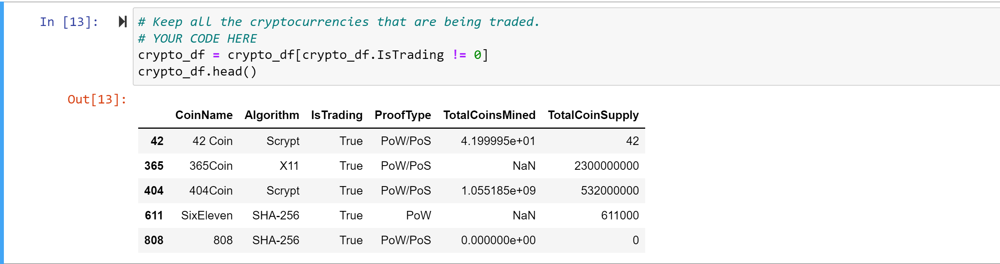

# Cryptocurrencies:  By David Matheny:  Date 4/16/2022

## Background: 
You and Martha have done your research. You understand what unsupervised learning is used for, how to process data, how to cluster, how to reduce your dimensions, and how to reduce the principal components using PCA. It’s time to put all these skills to use by creating an analysis for your clients who are preparing to get into the cryptocurrency market.

Martha is a senior manager for the Advisory Services Team at Accountability Accounting, one of your most important clients. Accountability Accounting, a prominent investment bank, is interested in offering a new cryptocurrency investment portfolio for its customers. The company, however, is lost in the vast universe of cryptocurrencies. So, they’ve asked you to create a report that includes what cryptocurrencies are on the trading market and how they could be grouped to create a classification system for this new investment.

The data Martha will be working with is not ideal, so it will need to be processed to fit the machine learning models. Since there is no known output for what Martha is looking for, she has decided to use unsupervised learning. To group the cryptocurrencies, Martha decided on a clustering algorithm. She’ll use data visualizations to share her findings with the board.

## Deliverable 1: Preprocessing the Data for PCA

-All cryptocurrencies that are not being traded are removed

-The IsTrading column is dropped 

-All the rows that have at least one null value are removed

-All the rows that do not have coins being mined are removed

-The CoinName column is dropped

-A new DataFrame is created that stores all cryptocurrency names from the CoinName column and retains the index from the crypto_df DataFrame

-The get_dummies() method is used to create variables for the text features, which are then stored in a new DataFrame, X

-The features from the X DataFrame have been standardized using the StandardScaler fit_transform() function 

## Deliverable 2: Reducing Data Dimensions Using PCA

-Using the information we’ve provided, apply PCA to reduce the dimensions to three principal components.

-Create a new DataFrame named pcs_df that includes the following columns, PC 1, PC 2, and PC 3, and uses the index of the crypto_df DataFrame as the index.

## Deliverable 3: Clustering Cryptocurrencies Using K-means

-An elbow curve is created using hvPlot to find the best value for K 

-Predictions are made on the K clusters of the cryptocurrencies’ data

-A new DataFrame is created with the same index as the crypto_df DataFrame and has the following columns: Algorithm, ProofType, TotalCoinsMined, TotalCoinSupply, PC 1, PC 2, PC 3, CoinName, and Class

## Deliverable 4: Visualizing Cryptocurrencies Results

-Create a 3D scatter plot using the Plotly Express scatter_3d() function to plot the three clusters from the clustered_df DataFrame.
-Add the CoinName and Algorithm columns to the hover_name and hover_data parameters, respectively, so each data point shows the CoinName and Algorithm on hover.

-Create a table with tradable cryptocurrencies using the hvplot.table() function

-Print the total number of tradable cryptocurrencies in the clustered_df DataFrame.

-Use the MinMaxScaler().fit_transform method to scale the TotalCoinSupply and TotalCoinsMined columns between the given range of zero and one

-Create a new DataFrame using the clustered_df DataFrame index that contains the scaled data you created in Step 5.
-Add the CoinName column from the clustered_df DataFrame to the new DataFrame.
-Add the Class column from the clustered_df DataFrame to the new DataFrame.

-Create an hvplot scatter plot with x="TotalCoinsMined", y="TotalCoinSupply", and by="Class", and have it show the CoinName when you hover over the the data point.
